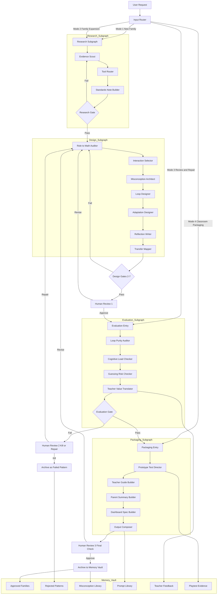

# Math Game Factory — Orchestration V3 Blueprint

Design document for the LangGraph-based orchestration system.
This is a committed blueprint, not a running system. Implementation begins
after Bakery Rush reaches Pass 3 and the Misconception Architect produces
its first real artifact. See Section 12 for the readiness checklist.

---

## 1. Core Idea

The OS spec becomes the rulebook.
The orchestrator becomes the worker system.

```
docs/os_spec_2026.md
    → defines rules, schema, gates, quality standards

orchestrator_v3/graph.py
    → runs agents in order, stores state, routes decisions, blocks weak outputs

orchestrator_v3/memory/
    → remembers prior builds, failures, misconceptions, teacher feedback, reusable patterns

artifacts/
    → game specs, prototype briefs, teacher guides, test plans, revision notes
```

---

## 2. Stack

| Layer | Tool | Why |
|---|---|---|
| Graph orchestration | **LangGraph** | First-class stateful nodes, conditional edges, checkpoints, subgraphs, human-in-the-loop pauses — matches a gate-heavy design pipeline exactly |
| Agent logic | LangChain-style node prompts or direct Claude API | Agents are already prompt-based; nodes wrap them |
| Observability | **LangSmith** | Trace every node, log every gate decision, compare runs across game families |
| Role prototyping | CrewAI (optional) | Useful for testing new agent roles cheaply before locking into the LangGraph schema |

---

## 3. Visual Orchestration Diagram



---

## 4. Four Operating Modes

| Mode | When to use | Example input |
|---|---|---|
| 1. New Family Build | Starting from scratch | "Create an upper elementary fractions game using Combine and Build" |
| 2. Family Expansion | Extending an existing game | "Expand Fire Dispatch into coordinate grids and linear relationships" |
| 3. Review and Repair | After playtesting or weak prototype output | "Diagnose why learners guessed through Level 2 in Unit Circle" |
| 4. Classroom Packaging | Game is ready; needs educator outputs | "Create teacher guide, assessment note, parent summary, and classroom mode" |

---

## 5. Shared State

Full schema in `orchestrator_v3/state.py`. Key groupings:

**Identity:** `run_id`, `mode`, `user_goal`, `timestamp`

**Concept:** `game_title`, `game_family`, `age_band`, `grade_band`, `math_domain`, `target_skill`, `transfer_target`

**Design:** `role_fantasy`, `world_theme`, `primary_interaction`, `core_loop_map`, `progression_plan`, `adaptation_plan`

**Learning:** `misconception_map`, `evidence_of_understanding`, `guessing_risk_signals`, `reflection_plan`

**Evaluation:** `role_to_math_score`, `loop_purity_score`, `clarity_risks`, `overload_risks`, `teacher_value_score`, `gate_fail_reasons`

**Outputs:** `spec_draft`, `prototype_brief`, `teacher_guide`, `test_plan`, `dashboard_spec`

**Memory links:** `similar_prior_games`, `reusable_patterns`, `failed_patterns`

---

## 6. Agent Map

| Agent | Primary job | Key output fields |
|---|---|---|
| Input Router | Classify request into one of four modes | `mode` |
| Evidence Scout | Find research, standards, tool recommendations for concept + age band | `evidence_summary`, `standards_notes`, `tool_recommendations` |
| Role-to-Math Auditor | Score whether role genuinely requires the math | `role_to_math_score`, authenticity risks |
| Interaction Selector | Choose primary interaction type from approved set | `primary_interaction` |
| Misconception Architect | Build probable error map before build starts | `misconception_map` |
| Loop Designer | Design the exact player loop (notice → solve → act → world changes) | `core_loop_map` |
| Adaptation Designer | Build hint rules, alternate representations, misconception retries | `adaptation_plan` |
| Reflection Writer | Write planning / monitoring / evaluation prompts | `reflection_plan` |
| Loop Purity Auditor | Test whether player action IS the math | `loop_purity_score` (wraps `utils/loop_purity_auditor.py`) |
| Cognitive Load Checker | Flag reading overload, simultaneous demands, control mismatch | `clarity_risks`, `overload_risks` |
| Guessing Risk Checker | Flag loops where speed or pattern-copy bypasses learning | `guessing_risk_signals` |
| Teacher Value Translator | Turn design into classroom language | `teacher_guide` stub |
| Prototype Test Director | Build silent observation playtest kit | `test_plan` |
| Output Composer | Assemble all final artifacts | `spec_draft`, `prototype_brief`, packaging bundle |

---

## 7. Gate Logic

Full definitions in `orchestrator_v3/policies/gates.yaml`.

| Gate | Fails if |
|---|---|
| Research Gate | No age-relevant evidence found, no tool recommendation, no assessment implication |
| Role-to-Math Gate | `role_to_math_score < 0.75` |
| Interaction Purity Gate | Chosen interaction does not make math clearer than alternatives |
| Misconception Gate | Fewer than 3 meaningful error categories named |
| Adaptation Gate | No misconception produces a different game response |
| Reflection Gate | Missing planning, monitoring, OR evaluation prompt |
| Transfer Gate | No `transfer_target` declared |
| Teacher Visibility Gate | No teacher guide or dashboard spec defined |
| Loop Purity Gate | `loop_purity_score < 0.80` |

On fail: conditional edge routes back to the appropriate node for repair. Human Review 2 triggered only when the same gate fails twice.

---

## 8. Human Review Points

Three structured checkpoints — not ad-hoc interruptions.

| Review | Trigger | Question | Options |
|---|---|---|---|
| Review 1 | After Design Subgraph (Mode 1/2 only) | "Does this feel like a real game family worth expanding?" | Approve → Evaluation / Revise → Design Subgraph |
| Review 2 | After second Evaluation Gate fail | "Repair this concept or kill it?" | Repair → Design Subgraph / Kill → Failed Pattern archive |
| Review 3 | Before final packaging release | "Is this classroom-ready?" | Approve → Memory Vault / Revise → Design Subgraph |

---

## 9. Memory System

| Layer | Scope | What it stores |
|---|---|---|
| Run memory | One graph execution | Current state, partial outputs, node-by-node revisions |
| Project memory | One game family | Approved versions, rejected versions, misconception history, tool choices, teacher notes |
| System memory | Whole factory | Interaction types that work by age band, common failure patterns, reusable prompts, strongest transfer bridges |

This is where the system compounds. Each approved game makes the next build faster and more accurate.

---

## 10. Build Phases

**Phase 1 — Policy layer first**
Encode the OS spec as machine-readable policy files before building agents.
- `orchestrator_v3/policies/os_rules.yaml`
- `orchestrator_v3/policies/gates.yaml`
- `orchestrator_v3/policies/misconception_taxonomy.yaml`
- `orchestrator_v3/policies/interaction_types.yaml`

**Phase 2 — Shared state + graph skeleton**
- `orchestrator_v3/state.py`
- `orchestrator_v3/graph.py`
- Checkpoint storage

**Phase 3 — V1 agents only (prove the spine)**
Input Router → Evidence Scout → Role-to-Math Auditor → Misconception Architect → Loop Designer → Loop Purity Auditor → Output Composer

Output: one-page game family spec + misconception map + prototype brief + teacher value note

**Phase 4 — Evaluation + human review**
Add: Cognitive Load Checker, Guessing Risk Checker, Teacher Value Translator, human review UI, fail-and-repair routing

**Phase 5 — Packaging outputs**
Add: Prototype Test Director, Teacher Guide Builder, Parent Summary Builder, Dashboard Spec Builder

---

## 11. V1 Minimal Graph

```python
from langgraph.graph import StateGraph, END
from orchestrator_v3.state import OrchestratorState

def build_v1_graph():
    graph = StateGraph(OrchestratorState)

    graph.add_node("input_router",           input_router)
    graph.add_node("evidence_scout",         evidence_scout)
    graph.add_node("role_to_math_auditor",   role_to_math_auditor)
    graph.add_node("misconception_architect",misconception_architect)
    graph.add_node("loop_designer",          loop_designer)
    graph.add_node("loop_purity_auditor",    loop_purity_auditor)
    graph.add_node("output_composer",        output_composer)

    graph.set_entry_point("input_router")
    graph.add_edge("input_router",            "evidence_scout")
    graph.add_edge("evidence_scout",          "role_to_math_auditor")
    graph.add_edge("role_to_math_auditor",    "misconception_architect")
    graph.add_edge("misconception_architect", "loop_designer")
    graph.add_edge("loop_designer",           "loop_purity_auditor")

    graph.add_conditional_edges(
        "loop_purity_auditor",
        route_after_purity_check,        # returns "repair" | "pass"
        {
            "repair": "role_to_math_auditor",
            "pass":   "output_composer",
        }
    )

    graph.add_edge("output_composer", END)
    return graph.compile()
```

---

## 12. Implementation Readiness Checklist

Do not build v1 until all of these are true:

- [ ] Bakery Rush Pass 3 complete (reflection beat implemented and tested)
- [ ] Loop Purity Auditor run against all three current games
- [ ] Misconception Architect produces at least one real artifact (not seeded library)
- [ ] `orchestrator_v3/state.py` reviewed and approved
- [ ] `orchestrator_v3/policies/gates.yaml` reviewed and approved

---

## 13. Naming

| Component | Name |
|---|---|
| Full system | Math Game Factory Orchestrator |
| Input classifier | MGF Router |
| Research pipeline | MGF Research Graph |
| Design pipeline | MGF Design Graph |
| Evaluation pipeline | MGF Evaluation Graph |
| Packaging pipeline | MGF Packaging Graph |
| Persistence layer | MGF Memory Vault |
